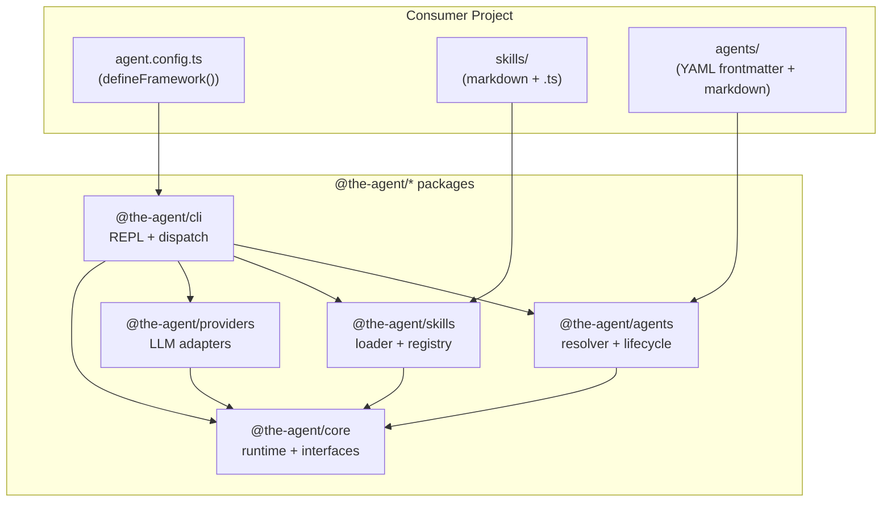

# Architecture: the-agent

## Overview

the-agent is a TypeScript monorepo framework for building CLI-native AI agents. It provides a
structured runtime loop, a skill system backed by markdown files with optional TypeScript handlers,
YAML-defined agent personas, and pluggable LLM adapters. The framework is designed for sub-3-second
cold start, under 50MB install size, and zero dependencies between domain packages (skills, agents,
providers) except through the core interface contracts.

## Architecture Style

**Layered monolith with explicit interface contracts.**

The five packages form a strict dependency hierarchy. No circular dependencies are permitted. All
cross-package communication goes through interfaces defined in `@the-agent/core`. This allows any
package to be replaced or extended without modifying others.

## System Context



## Package Dependency Graph

```
@the-agent/cli
  ├── @the-agent/core
  ├── @the-agent/agents
  ├── @the-agent/skills
  └── @the-agent/providers

@the-agent/agents
  └── @the-agent/core

@the-agent/skills
  └── @the-agent/core

@the-agent/providers
  └── @the-agent/core

@the-agent/core
  └── (no internal dependencies)
```

### Public API Surfaces

| Package | Exported symbols |
|---|---|
| `core` | All interfaces, state machine, runtime loop, context assembler, cache, memory |
| `providers` | `AnthropicAdapter`, `OpenAIAdapter`, `GoogleAdapter`, `OllamaAdapter`, `createAdapter()` |
| `skills` | `loadSkills()`, `SkillRegistry`, `defineSkill()` |
| `agents` | `loadAgents()`, `AgentRegistry`, `defineAgent()` |
| `cli` | `createCLI()`, `defineFramework()` |

## Technology Stack

- **Language**: TypeScript 5.x (strict mode, `exactOptionalPropertyTypes`)
- **Runtime**: Node.js >= 18 (native `fetch`, `fs/promises`, `readline`)
- **Schema / Validation**: Zod 3.x (single source of truth for all types)
- **Markdown**: `gray-matter` (YAML frontmatter parsing), `marked` (rendering)
- **REPL**: Node.js `readline` (no external REPL library)
- **Testing**: Vitest
- **Build**: `tsc` (project references), no bundler
- **Package manager**: npm workspaces

## Core Interfaces

All interfaces live in `packages/core/src/interfaces/`. Zod schemas are the canonical definitions;
TypeScript types are derived from them via `z.infer<>`.

### Primitive Types

```typescript
// packages/core/src/interfaces/message.ts
import { z } from "zod";

export const RoleSchema = z.enum(["user", "assistant", "system", "tool"]);
export type Role = z.infer<typeof RoleSchema>;

export const MessageSchema = z.object({
  id: z.string().uuid(),
  role: RoleSchema,
  content: z.string(),
  timestamp: z.number().int().positive(),
  toolCallId: z.string().optional(),  // for role=tool responses
  metadata: z.record(z.unknown()).optional(),
});
export type Message = z.infer<typeof MessageSchema>;
```

### Tool System

```typescript
// packages/core/src/interfaces/tool.ts
import { z } from "zod";

export const ToolParameterSchema = z.object({
  type: z.enum(["string", "number", "boolean", "array", "object"]),
  description: z.string(),
  required: z.boolean().default(false),
  enum: z.array(z.string()).optional(),
  items: z.lazy((): z.ZodTypeAny => ToolParameterSchema).optional(),
});
export type ToolParameter = z.infer<typeof ToolParameterSchema>;

export const ToolSchema = z.object({
  name: z.string().regex(/^[a-z][a-z0-9_-]*$/),
  description: z.string().min(1),
  parameters: z.record(ToolParameterSchema),
  handler: z.function(
    z.tuple([z.record(z.unknown())]),
    z.promise(z.unknown())
  ),
  // which skill or agent registered this tool
  source: z.enum(["skill", "agent", "builtin"]),
  sourceId: z.string().optional(),
});
export type Tool = z.infer<typeof ToolSchema>;

export const ToolCallSchema = z.object({
  id: z.string().uuid(),
  name: z.string(),
  arguments: z.record(z.unknown()),
});
export type ToolCall = z.infer<typeof ToolCallSchema>;

export const ToolResultSchema = z.object({
  toolCallId: z.string().uuid(),
  name: z.string(),
  output: z.unknown(),
  error: z.string().optional(),
  durationMs: z.number().int().nonnegative(),
});
export type ToolResult = z.infer<typeof ToolResultSchema>;
```

### LLM Adapter Contract

```typescript
// packages/core/src/interfaces/llm-adapter.ts
import { z } from "zod";
import type { Message } from "./message.js";
import type { Tool } from "./tool.js";

export const CompletionOptionsSchema = z.object({
  model: z.string(),
  maxTokens: z.number().int().positive().default(4096),
  temperature: z.number().min(0).max(2).default(1),
  systemPrompt: z.string().optional(),
  tools: z.array(z.custom<Tool>()).optional(),
  stream: z.boolean().default(false),
});
export type CompletionOptions = z.infer<typeof CompletionOptionsSchema>;

// Discriminated union — the runtime only ever receives one signal type per turn
export const CompletionSignalSchema = z.discriminatedUnion("type", [
  z.object({
    type: z.literal("text"),
    content: z.string(),
    stopReason: z.enum(["end_turn", "max_tokens", "stop_sequence"]),
  }),
  z.object({
    type: z.literal("tool_use"),
    calls: z.array(z.object({
      id: z.string(),
      name: z.string(),
      arguments: z.record(z.unknown()),
    })),
  }),
  z.object({
    type: z.literal("error"),
    code: z.string(),
    message: z.string(),
    retryable: z.boolean(),
  }),
]);
export type CompletionSignal = z.infer<typeof CompletionSignalSchema>;

export interface LLMAdapter {
  readonly providerId: string;
  readonly supportedModels: readonly string[];

  complete(
    messages: Message[],
    options: CompletionOptions
  ): Promise<CompletionSignal>;

  stream(
    messages: Message[],
    options: CompletionOptions,
    onDelta: (delta: string) => void
  ): Promise<CompletionSignal>;

  health(): Promise<{ ok: boolean; latencyMs: number }>;
}
```

### Agent Config

```typescript
// packages/core/src/interfaces/agent-config.ts
import { z } from "zod";

export const AgentConfigSchema = z.object({
  id: z.string().regex(/^[a-z][a-z0-9-]*$/),
  name: z.string().min(1),
  description: z.string().optional(),
  // resolved file path to the markdown persona document
  personaFile: z.string().optional(),
  systemPrompt: z.string().optional(),
  // tools this agent is allowed to call (name pattern or *)
  allowedTools: z.array(z.string()).default(["*"]),
  model: z.string().optional(),  // overrides framework default
  temperature: z.number().min(0).max(2).optional(),
  maxTurns: z.number().int().positive().default(30),
  hooks: z.object({
    beforeTurn: z.function().optional(),
    afterTurn: z.function().optional(),
    onError: z.function().optional(),
  }).optional(),
});
export type AgentConfig = z.infer<typeof AgentConfigSchema>;
```

### Skill Config

```typescript
// packages/core/src/interfaces/skill-config.ts
import { z } from "zod";
import type { Tool } from "./tool.js";

export const SkillFrontmatterSchema = z.object({
  name: z.string().regex(/^\/[a-z][a-z0-9-]*$/),  // must start with /
  description: z.string().min(1),
  version: z.string().optional(),
  author: z.string().optional(),
  // parameters defined inline in frontmatter for purely markdown skills
  parameters: z.record(z.object({
    type: z.enum(["string", "number", "boolean"]),
    description: z.string(),
    required: z.boolean().default(false),
  })).optional(),
  // if true, a co-located .ts handler MUST exist
  requiresHandler: z.boolean().default(false),
});
export type SkillFrontmatter = z.infer<typeof SkillFrontmatterSchema>;

export const SkillConfigSchema = z.object({
  frontmatter: SkillFrontmatterSchema,
  markdownBody: z.string(),
  handlerPath: z.string().optional(),  // resolved path to .ts/.js handler
  // compiled tool derived from this skill
  tool: z.custom<Tool>().optional(),
  sourceFile: z.string(),
});
export type SkillConfig = z.infer<typeof SkillConfigSchema>;

export const SkillModeSchema = z.enum(["strict", "permissive"]);
export type SkillMode = z.infer<typeof SkillModeSchema>;
```

### defineFramework() API

```typescript
// packages/cli/src/define-framework.ts
import { z } from "zod";
import type { LLMAdapter } from "@the-agent/core";

const ProviderConfigSchema = z.discriminatedUnion("provider", [
  z.object({
    provider: z.literal("anthropic"),
    apiKey: z.string(),
    defaultModel: z.string().default("claude-opus-4-6"),
  }),
  z.object({
    provider: z.literal("openai"),
    apiKey: z.string(),
    defaultModel: z.string().default("gpt-4o"),
  }),
  z.object({
    provider: z.literal("google"),
    apiKey: z.string(),
    defaultModel: z.string().default("gemini-2.0-flash"),
  }),
  z.object({
    provider: z.literal("ollama"),
    baseUrl: z.string().url().default("http://localhost:11434"),
    defaultModel: z.string(),
  }),
]);

const MemoryConfigSchema = z.object({
  enabled: z.boolean().default(false),
  backend: z.enum(["sqlite", "json-file"]).default("json-file"),
  path: z.string().optional(),
  maxEntries: z.number().int().positive().default(1000),
});

const CacheConfigSchema = z.object({
  enabled: z.boolean().default(true),
  ttlSeconds: z.number().int().positive().default(300),
  maxSizeMb: z.number().positive().default(50),
});

const FrameworkConfigSchema = z.object({
  // which LLM provider to use
  llm: ProviderConfigSchema,

  // directories to scan for skills and agents (relative to project root)
  skillsDir: z.string().default("./skills"),
  agentsDir: z.string().default("./agents"),

  // how to handle malformed or handler-less skills
  skillMode: z.enum(["strict", "permissive"]).default("permissive"),

  // default agent if none is specified
  defaultAgent: z.string().optional(),

  // optional overrides
  memory: MemoryConfigSchema.optional(),
  cache: CacheConfigSchema.optional(),

  // custom adapters — for teams that bring their own LLM client
  customAdapter: z.custom<LLMAdapter>().optional(),

  // telemetry / observability
  telemetry: z.object({
    enabled: z.boolean().default(false),
    endpoint: z.string().url().optional(),
    serviceName: z.string().default("the-agent"),
  }).optional(),
});

export type FrameworkConfig = z.infer<typeof FrameworkConfigSchema>;

/**
 * defineFramework() is the single configuration entry point.
 * Place it in agent.config.ts at the project root.
 *
 * @example
 * // agent.config.ts
 * import { defineFramework } from "@the-agent/cli";
 *
 * export default defineFramework({
 *   llm: {
 *     provider: "anthropic",
 *     apiKey: process.env.ANTHROPIC_API_KEY!,
 *     defaultModel: "claude-opus-4-6",
 *   },
 *   skillsDir: "./skills",
 *   agentsDir: "./agents",
 *   skillMode: "permissive",
 *   defaultAgent: "default",
 *   memory: { enabled: true, backend: "sqlite" },
 * });
 */
export function defineFramework(config: FrameworkConfig): FrameworkConfig {
  // Validate at definition time — fail fast before any runtime work
  return FrameworkConfigSchema.parse(config);
}
```

## Skill Loading Pipeline

Executed once at startup by `@the-agent/skills`. The result is a `SkillRegistry` injected into the
runtime.

```
startup
  │
  ▼
1. Discover ──► glob skillsDir for **/*.md
  │
  ▼
2. Parse     ──► gray-matter extracts YAML frontmatter + markdown body
  │              Validate frontmatter against SkillFrontmatterSchema (Zod)
  │              If skillMode=strict: throw on validation error
  │              If skillMode=permissive: log warning, skip file
  │
  ▼
3. Resolve   ──► for each parsed skill, check for co-located .ts / .js handler
  │              pattern: skills/commit/index.md -> skills/commit/handler.ts
  │              or:      skills/commit.md -> skills/commit.ts
  │
  ▼
4. Compile   ──► if handler exists: dynamic import() the handler module
  │              handler module must export: { tool: Tool } (validated at load)
  │              if no handler: synthesize a Tool whose handler interpolates
  │              the markdown body as a prompt sent back to the LLM
  │
  ▼
5. Register  ──► SkillRegistry.register(skill)
  │              conflict: duplicate name -> warn + last-wins in permissive,
  │                                         throw in strict
  │
  ▼
SkillRegistry ready
```

### Handler Contract

```typescript
// packages/skills/src/interfaces/handler.ts
import type { Tool } from "@the-agent/core";

// Every co-located handler file must export this shape
export interface SkillHandler {
  tool: Tool;
}

// Helper — gives type safety when authoring handlers
export function defineSkill(handler: SkillHandler): SkillHandler {
  return handler;
}
```

### Markdown-Only Skill (prompt interpolation)

When no `.ts` handler exists, the skill body becomes a prompt template:

```
---
name: /summarize
description: Summarize a piece of text
parameters:
  text:
    type: string
    description: The text to summarize
    required: true
  length:
    type: string
    description: "Target length: short | medium | long"
    required: false
---

Summarize the following text.
Target length: {{length | "medium"}}.

Text:
{{text}}
```

The synthesized tool handler sends this interpolated string as a new user message and returns the
next LLM completion.

## Agent Resolution Pipeline

Executed once at startup by `@the-agent/agents`. The result is an `AgentRegistry` injected into
the runtime.

```
startup
  │
  ▼
1. Discover ──► glob agentsDir for **/*.md
  │
  ▼
2. Parse     ──► gray-matter extracts YAML frontmatter + markdown body
  │              Validate against AgentFrontmatterSchema (Zod)
  │              Frontmatter fields: id, name, description, model,
  │              temperature, allowedTools, maxTurns
  │
  ▼
3. Build     ──► system prompt = merge(frontmatter.systemPrompt, markdownBody)
  │              If both exist: markdownBody appended after systemPrompt
  │              If only markdownBody: used as full system prompt
  │
  ▼
4. Resolve   ──► check for co-located lifecycle hook file
  │              pattern: agents/coder.md -> agents/coder.hooks.ts
  │              hooks module exports: { beforeTurn?, afterTurn?, onError? }
  │
  ▼
5. Register  ──► AgentRegistry.register(agent)
  │              duplicate id -> throw always (agent identity must be unique)
  │
  ▼
AgentRegistry ready
```

### Agent YAML Frontmatter Schema

```typescript
// packages/agents/src/interfaces/agent-frontmatter.ts
import { z } from "zod";

export const AgentFrontmatterSchema = z.object({
  id: z.string().regex(/^[a-z][a-z0-9-]*$/),
  name: z.string(),
  description: z.string().optional(),
  model: z.string().optional(),
  temperature: z.number().min(0).max(2).optional(),
  allowedTools: z.array(z.string()).default(["*"]),
  maxTurns: z.number().int().positive().default(30),
  // inline system prompt — markdown body appended after this
  systemPrompt: z.string().optional(),
});
export type AgentFrontmatter = z.infer<typeof AgentFrontmatterSchema>;
```

### Example Agent File

```markdown
---
id: coder
name: Code Assistant
description: Expert TypeScript and systems programmer
model: claude-opus-4-6
allowedTools:
  - read_file
  - write_file
  - run_tests
maxTurns: 50
---

You are an expert TypeScript programmer with deep knowledge of Node.js,
type systems, and software architecture.

When writing code:
- Prefer explicit types over inference where it aids readability
- Always handle errors explicitly
- Write tests alongside implementation
```

## State Management

The `RuntimeState` lives entirely within `@the-agent/core`. A new state object is created per
session (REPL launch) and per agent turn. The runtime loop owns mutation; all other packages read
state via immutable snapshots.

```typescript
// packages/core/src/state/runtime-state.ts
import { z } from "zod";
import type { Message } from "../interfaces/message.js";
import type { ToolResult } from "../interfaces/tool.js";

// Immutable snapshot passed to hooks and context assembler
export interface RuntimeSnapshot {
  readonly sessionId: string;
  readonly agentId: string;
  readonly turnNumber: number;
  readonly messages: readonly Message[];
  readonly pendingToolCalls: readonly string[];    // ids awaiting results
  readonly completedToolResults: readonly ToolResult[];
  readonly phase: RuntimePhase;
}

export type RuntimePhase =
  | "idle"
  | "assembling_context"
  | "awaiting_completion"
  | "dispatching_tools"
  | "awaiting_tool_results"
  | "summarizing"
  | "error";

// Mutable state — only the RuntimeLoop mutates this
export class RuntimeState {
  private _snapshot: RuntimeSnapshot;

  constructor(sessionId: string, agentId: string) {
    this._snapshot = {
      sessionId,
      agentId,
      turnNumber: 0,
      messages: [],
      pendingToolCalls: [],
      completedToolResults: [],
      phase: "idle",
    };
  }

  get snapshot(): RuntimeSnapshot {
    return Object.freeze({ ...this._snapshot });
  }

  appendMessage(msg: Message): void {
    this._snapshot = {
      ...this._snapshot,
      messages: [...this._snapshot.messages, msg],
    };
  }

  advanceTurn(): void {
    this._snapshot = {
      ...this._snapshot,
      turnNumber: this._snapshot.turnNumber + 1,
      pendingToolCalls: [],
      completedToolResults: [],
    };
  }

  setPhase(phase: RuntimePhase): void {
    this._snapshot = { ...this._snapshot, phase };
  }

  recordToolCall(callId: string): void {
    this._snapshot = {
      ...this._snapshot,
      pendingToolCalls: [...this._snapshot.pendingToolCalls, callId],
    };
  }

  recordToolResult(result: ToolResult): void {
    this._snapshot = {
      ...this._snapshot,
      pendingToolCalls: this._snapshot.pendingToolCalls.filter(
        (id) => id !== result.toolCallId
      ),
      completedToolResults: [...this._snapshot.completedToolResults, result],
    };
  }
}
```

### Runtime Loop State Machine

```
     ┌───────────────────────────────────────────────────────┐
     │                      RuntimeLoop                       │
     └───────────────────────────────────────────────────────┘

 [idle]
    │ user sends message
    ▼
 [assembling_context]
    │ ContextAssembler builds message array
    │ (system prompt + history + memory recall + current message)
    ▼
 [awaiting_completion]
    │ LLMAdapter.complete() or .stream()
    │
    ├─── CompletionSignal{type:"text"} ──────────► [idle] (emit to REPL)
    │
    ├─── CompletionSignal{type:"tool_use"} ──────► [dispatching_tools]
    │                                                  │
    │                                         dispatch each ToolCall
    │                                         in parallel via ToolDispatcher
    │                                                  │
    │                                              [awaiting_tool_results]
    │                                                  │ all results in
    │                                                  │ append tool results
    │                                                  │ to message history
    │                                                  ▼
    │                                          loop back to [assembling_context]
    │
    └─── CompletionSignal{type:"error"} ─────────► [error]
                                                       │ retryable?
                                                       ├─ yes: back to [awaiting_completion]
                                                       └─ no:  emit error to REPL, [idle]
```

## Cross-Cutting Concerns

### Security

- API keys are never stored in state or logged. They exist only in `FrameworkConfig` and are
  passed directly to provider constructors.
- Tool handlers run in-process. Skill authors are responsible for sandboxing external calls.
- `allowedTools` on each agent restricts which registered tools can be dispatched in that session.
  The `ToolDispatcher` enforces this list before invocation.

### Performance

- Skill and agent loading runs in parallel at startup via `Promise.all()`.
- Handler modules are dynamically imported once and cached. Re-imports hit Node.js module cache.
- `CacheLayer` in core wraps LLM completions using an LRU cache keyed on
  `sha256(model + messages JSON)`. Disabled by default; useful for development.
- Context assembly truncates message history to stay within model token limits using a simple
  token estimator (4 chars per token approximation) before calling the adapter.

### Observability

- Every `RuntimePhase` transition emits a structured log event via the `Logger` interface.
- Tool dispatch records duration in `ToolResult.durationMs`.
- If `telemetry.enabled=true`, phase transitions and completions are sent as OpenTelemetry spans
  to the configured endpoint. This adds one optional dependency (`@opentelemetry/sdk-node`).
- Log levels: `debug` (phase transitions, tool calls), `info` (turn summary), `warn` (skill
  validation failures), `error` (adapter errors, hook throws).

### Reliability

- LLM adapter errors with `retryable=true` trigger exponential backoff: 3 attempts, 1s/2s/4s.
- Tool handler errors do not abort the session — the error string is placed in `ToolResult.error`
  and returned to the LLM as context.
- Agent lifecycle hooks (`beforeTurn`, `afterTurn`, `onError`) are wrapped in try/catch. A
  throwing hook is logged and skipped; it does not crash the loop.

## Key Patterns

1. **Zod-first types** — No TypeScript `interface` or `type` without a Zod schema behind it.
   `z.infer<>` derives the TS type. Validation happens at each package boundary.
2. **Discriminated union signals** — `CompletionSignal` uses a `type` discriminant so the runtime
   loop switches cleanly without `instanceof` checks or duck typing.
3. **Immutable snapshots** — `RuntimeState` mutates internally but exposes a frozen snapshot.
   Hooks and assemblers cannot corrupt runtime state.
4. **Registry pattern** — `SkillRegistry` and `AgentRegistry` expose `get(id)`, `list()`, and
   `register(item)`. The CLI wires them together; neither registry knows about the other.
5. **Adapter pattern** — `LLMAdapter` is an interface. Providers implement it. The runtime loop
   never imports a provider directly; it receives an adapter instance.
6. **Markdown as configuration** — Skills and agents are authored in markdown with YAML
   frontmatter. TypeScript handlers are opt-in. This allows non-engineers to define skills.

## Intent Routing System

The intent router sits between user input and agent dispatch. It resolves natural language to a
capability tag, then the capability tag resolves to an agent.

### Capability Tags

```typescript
// packages/core/src/interfaces/intent.ts
import { z } from "zod";

export const CapabilityTagSchema = z.enum([
  // Stage 1 (MVP)
  "code-review", "debug", "refactor", "architecture-analysis", "implementation",
  "test-strategy", "test-scenarios", "test-execution",
  "orchestrate", "phase-routing", "progress-report",
  "memory-store", "memory-recall",
  "context-assembly",
  // Stage 2
  "security-scan", "compliance-check", "cicd-pipeline",
  "requirements", "brainstorm", "ux-review", "acceptance-criteria",
  // Stage 3
  "data-analysis", "pipeline-design", "ml-guidance",
  "code-patch", "cross-language-propagation",
  // Meta
  "general",  // fallback when no specific capability matches
]);
export type CapabilityTag = z.infer<typeof CapabilityTagSchema>;

export const IntentSignalSchema = z.object({
  pattern: z.string(),                    // regex pattern for trie matching
  capability: CapabilityTagSchema,
  confidence: z.number().min(0).max(1),   // base confidence for this pattern
  keywords: z.array(z.string()),          // exact keyword triggers
});
export type IntentSignal = z.infer<typeof IntentSignalSchema>;

export const RoutingResultSchema = z.object({
  capability: CapabilityTagSchema,
  confidence: z.number().min(0).max(1),
  tier: z.enum(["fast", "llm"]),          // which tier resolved this
  agentId: z.string(),                     // resolved agent to handle this
  narration: z.string(),                   // human-readable routing explanation
});
export type RoutingResult = z.infer<typeof RoutingResultSchema>;
```

### Two-Tier Router

```typescript
// packages/core/src/intent/router.ts

export interface IntentRouter {
  /**
   * Route user input to a capability tag and agent.
   * Tier 1 (fast): keyword trie + regex patterns, < 50ms
   * Tier 2 (llm): LLM classifier, invoked only when Tier 1 confidence < threshold
   */
  route(input: string, snapshot: RuntimeSnapshot): Promise<RoutingResult>;

  /**
   * Register custom signals from .agent/signals/ directory.
   * Called at startup after built-in signals are loaded.
   */
  registerSignals(signals: IntentSignal[]): void;

  /**
   * Returns the full routing table for validation/debugging.
   */
  getRoutingTable(): Map<CapabilityTag, string>;  // tag -> agentId
}

export const CONFIDENCE_THRESHOLD = 0.75;
```

**Tier 1: Fast Path**
- Built-in signal registry maps regex patterns + keywords to capability tags
- Example: `/review|code.review|look.at.*code/i` → `code-review` (confidence 0.85)
- Custom signals from `.agent/signals/*.yaml` are merged at startup
- If best match confidence >= 0.75, resolve immediately

**Tier 2: LLM Classifier**
- Invoked only when Tier 1 confidence < 0.75
- Constrained prompt: "Classify this input into ONE of: {capability_list}. Return JSON."
- Uses the fast/cheap model (not the main agent model)
- Returns capability tag + acceptance criteria + confidence
- Result is cached for identical inputs (LRU, 5 min TTL)

**Routing Narration**
On every route resolution, the CLI emits a narration line before agent execution:
```
Treating this as code-review using Senior Engineer. Starting.
```
This is visible to the user and serves as both UX feedback and routing auditability.

### Capability → Agent Resolution

```typescript
// packages/core/src/intent/capability-map.ts

export const DEFAULT_CAPABILITY_MAP: Record<CapabilityTag, string> = {
  "code-review": "senior-engineer",
  "debug": "debugger",
  "refactor": "senior-engineer",
  "architecture-analysis": "solution-architect",
  "implementation": "coder",
  "test-strategy": "test-strategist",
  "test-scenarios": "scenario-generator",
  "test-execution": "scenario-executor",
  "orchestrate": "orchestrator",
  "phase-routing": "orchestrator",
  "progress-report": "delivery-manager",
  "memory-store": "default",
  "memory-recall": "default",
  "context-assembly": "default",
  "security-scan": "security-engineer",
  "compliance-check": "compliance-officer",
  "cicd-pipeline": "devops-engineer",
  "requirements": "requirements-analyst",
  "brainstorm": "facilitator",
  "ux-review": "ux-designer",
  "acceptance-criteria": "requirements-analyst",
  "data-analysis": "data-analyst",
  "pipeline-design": "data-engineer",
  "ml-guidance": "ml-engineer",
  "code-patch": "coder",
  "cross-language-propagation": "coder",
  "general": "default",
};
```

Teams override this map in `.agent/config.yaml`:
```yaml
capabilities:
  code-review:
    agent: my-custom-reviewer   # override built-in agent
    provider: capable-model      # use specific provider for this capability
```

## Completion Contracts

Each capability declares what "done" means. The runtime evaluates the contract after each agent
turn and decides whether to loop or exit.

### Contract Interface

```typescript
// packages/core/src/interfaces/completion.ts
import { z } from "zod";

export const CompletionConditionSchema = z.object({
  id: z.string(),
  description: z.string(),               // human-readable done condition
  check: z.enum(["artifact", "assertion", "manual"]),
  artifactPattern: z.string().optional(), // glob for artifact check (e.g., "*.md")
  assertionFn: z.function().optional(),   // runtime assertion function
});
export type CompletionCondition = z.infer<typeof CompletionConditionSchema>;

export const CompletionContractSchema = z.object({
  capability: z.string(),
  conditions: z.array(CompletionConditionSchema).min(1),
  maxTurns: z.number().int().positive().default(30),
  timeoutMs: z.number().int().positive().default(300_000),  // 5 min default
});
export type CompletionContract = z.infer<typeof CompletionContractSchema>;

export const CompletionResultSchema = z.object({
  done: z.boolean(),
  satisfiedConditions: z.array(z.string()),   // condition ids met
  unsatisfiedConditions: z.array(z.string()),  // condition ids not yet met
  summary: z.string(),
  artifacts: z.array(z.string()),              // file paths created/modified
  turnsUsed: z.number().int(),
  durationMs: z.number().int(),
});
export type CompletionResult = z.infer<typeof CompletionResultSchema>;
```

### Default Contracts per Capability

```typescript
// packages/skills/src/contracts/defaults.ts

export const DEFAULT_CONTRACTS: Record<string, CompletionContract> = {
  "code-review": {
    capability: "code-review",
    conditions: [
      { id: "findings", description: "All files reviewed with findings reported", check: "assertion" },
      { id: "summary", description: "Consolidated summary generated", check: "assertion" },
    ],
    maxTurns: 50,
    timeoutMs: 600_000,
  },
  "test-strategy": {
    capability: "test-strategy",
    conditions: [
      { id: "strategy-doc", description: "Test strategy document written", check: "artifact", artifactPattern: "**/test-strategy.md" },
      { id: "scenarios", description: "At least one test scenario defined", check: "assertion" },
    ],
    maxTurns: 30,
    timeoutMs: 300_000,
  },
  "brainstorm": {
    capability: "brainstorm",
    conditions: [
      { id: "synthesis", description: "Synthesis produced with decision record", check: "assertion" },
    ],
    maxTurns: 20,
    timeoutMs: 300_000,
  },
  // ... additional contracts for each capability
};
```

### Runtime Evaluation

The state machine gets a new phase between `awaiting_completion` and `idle`:

```
[awaiting_completion]
    │
    ├─── CompletionSignal{type:"text"} ──────► [evaluating_completion]
    │                                               │
    │                                    CompletionContract.evaluate()
    │                                               │
    │                                    ├── all conditions met ──► [idle] (emit summary)
    │                                    ├── conditions remain + turns < max ──► [assembling_context]
    │                                    └── turns >= max OR timeout ──► [idle] (emit partial summary)
    │
    ├─── CompletionSignal{type:"tool_use"} ──► [dispatching_tools] (unchanged)
    │
    └─── CompletionSignal{type:"error"} ──────► [error] (unchanged)
```

Teams override contracts in `.agent/config.yaml`:
```yaml
capabilities:
  code-review:
    done_condition: "all high-severity findings addressed"
    max_turns: 100
    timeout_ms: 900000
```

### Progress Events

During execution, the runtime emits structured progress events that the CLI renders:

```typescript
export const ProgressEventSchema = z.object({
  capability: z.string(),
  turnNumber: z.number(),
  maxTurns: z.number(),
  satisfiedConditions: z.array(z.string()),
  totalConditions: z.number(),
  currentActivity: z.string(),  // human-readable, e.g. "Reviewing auth/login.ts (3/12 files)"
});
```

## Configuration Reconciliation

### Two Config Layers

The framework supports two complementary configuration mechanisms:

1. **`agent.config.ts`** — Framework-level config (TypeScript, validated by Zod)
   - LLM provider, model, API keys
   - Skill/agent directory paths
   - Memory, cache, telemetry settings
   - Used by framework authors and project owners

2. **`.agent/config.yaml`** — Team-level overrides (YAML, validated by Zod at startup)
   - Capability → agent mapping overrides
   - Custom tools (name + command + description)
   - Provider routing per capability
   - Done-condition overrides

### Override Precedence (lowest to highest)

```
Built-in defaults < agent.config.ts < .agent/config.yaml < CLI flags
```

### .agent/ Directory Convention

```
.agent/
├── config.yaml           # team overrides (capabilities, tools, providers)
├── agents/               # custom agent definitions (one .md file per agent)
│   └── fintech-auditor.md
├── skills/               # custom skills (markdown + optional .ts)
│   └── internal-scan.md
└── signals/              # custom intent signals
    └── fintech.yaml      # adds compliance-check, aml-review capability tags
```

The `.agent/` directory is scanned at startup AFTER the framework's built-in skills and agents.
Team definitions with the same id as built-ins override them (last-writer wins).

### .agent/config.yaml Schema

```typescript
// packages/cli/src/config/team-config.ts
import { z } from "zod";

export const TeamConfigSchema = z.object({
  capabilities: z.record(z.object({
    agent: z.string().optional(),
    provider: z.string().optional(),
    done_condition: z.string().optional(),
    max_turns: z.number().int().positive().optional(),
    timeout_ms: z.number().int().positive().optional(),
  })).optional(),

  tools: z.array(z.object({
    name: z.string().regex(/^[a-z][a-z0-9_-]*$/),
    command: z.string(),
    description: z.string(),
    timeout_ms: z.number().int().positive().default(30_000),
  })).optional(),

  providers: z.record(z.object({
    adapter: z.enum(["anthropic", "openai", "google", "ollama"]),
    model: z.string(),
    api_key_env: z.string().optional(),  // env var name, NOT the key itself
    base_url: z.string().url().optional(),
  })).optional(),

  compat_mode: z.boolean().default(false),
}).strict();
```

## Validate Command

The `agent validate` subcommand checks all configuration without making LLM calls.

### Specification

```
agent validate [--verbose]

Reads:
  - agent.config.ts (framework config)
  - .agent/config.yaml (team overrides)
  - .agent/agents/*.md (custom agent definitions)
  - .agent/skills/*.md (custom skill definitions)
  - .agent/signals/*.yaml (custom intent signals)

Checks performed:
  1. Schema validation: all files parse and validate against their Zod schemas
  2. Agent resolution: all capability → agent mappings resolve to a registered agent
  3. Tool resolution: all agent allowedTools references resolve to a registered tool
  4. Signal validation: custom signals have valid regex patterns and reference known capabilities
  5. Provider config: named providers exist and env vars are set (no API call, just env check)
  6. Duplicate detection: warns on duplicate skill/agent ids between built-in and team
  7. Capability coverage: reports capabilities with no mapped agent

Output:
  - Human-readable report listing checks passed, warnings, and errors
  - --verbose: includes the full resolved routing table and capability map
  - Exit code 0: all checks pass (warnings are ok)
  - Exit code 1: any error found (schema failures, unresolved references)

Zero LLM calls — pure static analysis.
```

## Compatibility Alias Layer

For teams migrating from wicked-garden, the framework provides a command alias layer that maps
old `/plugin:command` syntax to new capability tags.

### Design

```typescript
// packages/cli/src/compat/aliases.ts
import { z } from "zod";

export const AliasMapSchema = z.record(z.string());  // old command -> new capability tag

export const DEFAULT_ALIASES: Record<string, string> = {
  // wicked-engineering
  "/wicked-engineering:review": "code-review",
  "/wicked-engineering:debug": "debug",
  "/wicked-engineering:arch": "architecture-analysis",
  "/wicked-engineering:plan": "implementation",
  "/wicked-engineering:docs": "general",
  // wicked-qe
  "/wicked-qe:scenarios": "test-scenarios",
  "/wicked-qe:qe-plan": "test-strategy",
  "/wicked-qe:qe-review": "code-review",
  "/wicked-qe:automate": "test-execution",
  // wicked-platform
  "/wicked-platform:security": "security-scan",
  "/wicked-platform:compliance": "compliance-check",
  "/wicked-platform:actions": "cicd-pipeline",
  // wicked-product
  "/wicked-product:elicit": "requirements",
  "/wicked-product:acceptance": "acceptance-criteria",
  "/wicked-product:ux-review": "ux-review",
  // wicked-jam
  "/wicked-jam:brainstorm": "brainstorm",
  "/wicked-jam:jam": "brainstorm",
  // wicked-crew
  "/wicked-crew:start": "orchestrate",
  "/wicked-crew:execute": "phase-routing",
  "/wicked-crew:status": "progress-report",
  // wicked-mem
  "/wicked-mem:store": "memory-store",
  "/wicked-mem:recall": "memory-recall",
  // wicked-data
  "/wicked-data:analyze": "data-analysis",
};
```

### Activation

Enabled via `.agent/config.yaml`:
```yaml
compat_mode: true  # enables old /plugin:command syntax mapping
```

When `compat_mode` is true:
1. Input starting with `/` is checked against the alias map first
2. If matched, the alias is resolved to a capability tag
3. The narration line shows: `Alias: /wicked-engineering:review → code-review`
4. A deprecation notice is logged once per session

Planned for removal in v2.0.

## Stage 1 Built-in Skill/Agent Inventory

### Built-in Agents (ship in packages/agents/)

| Agent ID | From Plugin | Capability Tags | Model |
|----------|------------|-----------------|-------|
| `default` | — | general | default |
| `coder` | engineering | implementation, refactor | default |
| `senior-engineer` | engineering | code-review | default |
| `debugger` | engineering | debug | default |
| `solution-architect` | engineering | architecture-analysis | capable |
| `test-strategist` | qe | test-strategy | default |
| `scenario-generator` | qe + scenarios | test-scenarios | default |
| `scenario-executor` | scenarios | test-execution | default |
| `orchestrator` | crew | orchestrate, phase-routing | default |
| `delivery-manager` | crew + delivery | progress-report | fast |
| `facilitator` | jam | brainstorm | default |

### Built-in Skills (ship in packages/skills/)

| Skill | From Plugin | Slash Command | Has TS Handler |
|-------|------------|---------------|----------------|
| Code Review | engineering | /review | No (markdown) |
| Debug | engineering | /debug | No |
| Architecture | engineering | /arch | No |
| Test Strategy | qe | /test-strategy | No |
| Generate Scenarios | qe | /scenarios | No |
| Run Tests | scenarios | /test | Yes |
| Start Project | crew | /start | Yes |
| Check Status | crew | /status | Yes |
| Brainstorm | jam | /brainstorm | No |
| Quick Jam | jam | /jam | No |
| Store Memory | mem | /remember | Yes |
| Recall Memory | mem | /recall | Yes |

## Resolved Design Questions

1. **Per-tool timeout**: Yes. 30 second default, configurable per tool via `timeout_ms` in
   frontmatter or `.agent/config.yaml` tool definitions. The `ToolDispatcher` wraps each
   `handler()` call in `Promise.race` with an `AbortController`.

2. **CacheLayer location**: Stays in `core`. The LRU implementation is ~50 lines and does not
   warrant a separate package. Uses a `Map` with TTL eviction, no external dependency.

3. **Token budget management**: Use `tiktoken` (via the `js-tiktoken` WebAssembly build, no
   native dependency) for Anthropic/OpenAI models. Fall back to 4-chars-per-token approximation
   for unknown models (Ollama custom). Budget: reserve 20% of context window for the response,
   use remaining 80% for messages. Oldest messages truncated first.

4. **Memory recall injection**: Inject as a separate system message appended after the main
   system prompt. Label it `[Memory Context]` so models can attribute it. This keeps recalled
   content distinguishable from the agent's persona instructions.

## Migration Strategy

### From wicked-garden to the-agent

1. Enable `compat_mode: true` in `.agent/config.yaml`
2. All `/wicked-*:command` syntax continues working via alias map
3. Gradually replace aliases with natural language intents
4. Custom agents in `.agent/agents/` replace team-specific plugin configurations
5. Disable `compat_mode` when migration is complete (planned removal in v2.0)

### Migration Guide Document

A side-by-side mapping document will be generated during the build phase, covering all 97
wicked-garden commands and their the-agent equivalents (capability tag + built-in skill).
